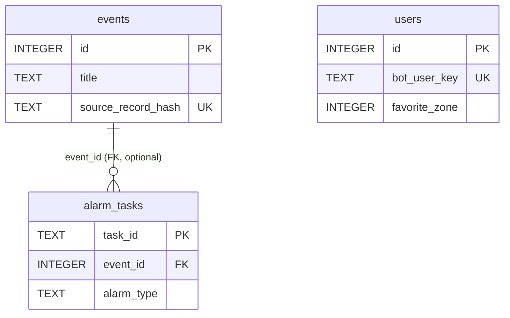

# 데이터베이스 ERD / 테이블 명세서

> KT Demo Alarm (집회 알림 서비스) 데이터베이스 스키마 정의서
>
> - **DB 엔진**: SQLite 3 (`sqlite3`, `row_factory = sqlite3.Row`)
> - **스키마 원본(Source of Truth)**: `app/database/models.py`
> - **부트스트랩/마이그레이션**: `app/database/bootstrap.py` (`apply_bootstrap_contract`)
> - **ERD 원본**: `docs/erd.vuerd.json` (erd-editor v3)
> - **테이블 수**: 3개 (`users`, `events`, `alarm_tasks`)

## 표기 규칙 (중요)

SQLite는 **타입 affinity** 방식을 사용하므로 컬럼에 **길이(length) 제약이 없습니다**.
아래 명세의 `길이` 항목은 SQLite에서 물리적으로 강제되지 않으며, 참고용으로 `-`(미지정)으로 표기합니다.
`유형`은 실제 `CREATE TABLE`에 선언된 타입 키워드(INTEGER / TEXT / REAL / DATETIME / BOOLEAN)를 그대로 사용합니다.

---

## 1. ERD 개요



| 관계 | 유형 | 설명 |
|------|------|------|
| `events.id` → `alarm_tasks.event_id` | 1 : N (비식별, 선택적) | 특정 집회(event)에 대해 발송된 알림 작업들을 연결. `event_id`는 NULL 허용(개별/전체/필터 발송 등 특정 event가 없는 경우 존재). `FOREIGN KEY (event_id) REFERENCES events(id)` |
| `users` | 독립 | 다른 테이블과 FK 관계 없음. `plusfriend_user_key` 기반으로 알림 발송 대상 선별 |

---

## 2. `users` — 카카오톡 채널 사용자

카카오톡 챗봇 사용자와 개인화(출발/도착 경로, 관심구역) 정보를 저장한다.

| 연번 | 항목ID | 항목명 | 길이 | 유형 | NULL | Default 값 | 비고 |
|:---:|---|---|:---:|---|---|---|---|
| 1 | id | 사용자 PK | - | INTEGER | Not Null | 자동증가 | PRIMARY KEY AUTOINCREMENT |
| 2 | bot_user_key | 카카오 봇 사용자 키 | - | TEXT | Null | | UNIQUE. 사용자 식별 기본 키값 |
| 3 | open_id | 카카오 Open ID | - | TEXT | Null | | 인덱스 `idx_users_open_id` |
| 4 | plusfriend_user_key | 플러스친구 사용자 키 | - | TEXT | Null | | 알림 발송 대상 키. 인덱스 `idx_users_plusfriend_key` |
| 5 | first_message_at | 최초 메시지 시각 | - | DATETIME | Null | | |
| 6 | last_message_at | 최근 메시지 시각 | - | DATETIME | Null | | |
| 7 | message_count | 메시지 누적 수 | - | INTEGER | Null | 1 | |
| 8 | location | 위치(구 텍스트) | - | TEXT | Null | | ERD상 `[DEPRECATED]`. `users.py` 조회 응답에 잔존 |
| 9 | active | 활성 여부 | - | BOOLEAN | Null | TRUE | |
| 10 | is_alarm_on | 알림 수신 on/off | - | BOOLEAN | Null | TRUE | |
| 11 | departure_name | 출발지 명칭 | - | TEXT | Null | | |
| 12 | departure_address | 출발지 주소 | - | TEXT | Null | | |
| 13 | departure_x | 출발지 경도(x) | - | REAL | Null | | |
| 14 | departure_y | 출발지 위도(y) | - | REAL | Null | | |
| 15 | arrival_name | 도착지 명칭 | - | TEXT | Null | | |
| 16 | arrival_address | 도착지 주소 | - | TEXT | Null | | |
| 17 | arrival_x | 도착지 경도(x) | - | REAL | Null | | |
| 18 | arrival_y | 도착지 위도(y) | - | REAL | Null | | |
| 19 | route_updated_at | 경로 갱신 시각 | - | DATETIME | Null | | |
| 20 | marked_bus | 즐겨찾는 버스 | - | TEXT | Null | | ERD상 `[DEPRECATED]`. `users.py` 프로필 저장/조회에 잔존 |
| 21 | language | 언어 설정 | - | TEXT | Null | | ERD상 `[DEPRECATED]`. `users.py`/`admin.py`에 잔존 |
| 22 | favorite_zone | 관심 구역 | - | INTEGER | Null | | 값: `1` \| `2` \| `3` \| `NULL`. 구역별 예약 알림(`zone_alarm_service`) 대상 선별 |

**인덱스**
- `idx_users_open_id` ON `users(open_id)`
- `idx_users_plusfriend_key` ON `users(plusfriend_user_key)`

**관련 DDL** (`app/database/models.py` · `USERS_TABLE_SCHEMA`)
```sql
CREATE TABLE IF NOT EXISTS users (
    id INTEGER PRIMARY KEY AUTOINCREMENT,
    bot_user_key TEXT UNIQUE,
    open_id TEXT,
    plusfriend_user_key TEXT,
    first_message_at DATETIME,
    last_message_at DATETIME,
    message_count INTEGER DEFAULT 1,
    location TEXT,
    active BOOLEAN DEFAULT TRUE,
    is_alarm_on BOOLEAN DEFAULT TRUE,
    -- 경로 정보
    departure_name TEXT,
    departure_address TEXT,
    departure_x REAL,
    departure_y REAL,
    arrival_name TEXT,
    arrival_address TEXT,
    arrival_x REAL,
    arrival_y REAL,
    route_updated_at DATETIME,
    -- 개인화 설정
    marked_bus TEXT,
    language TEXT,
    favorite_zone INTEGER
);
CREATE INDEX IF NOT EXISTS idx_users_open_id ON users(open_id);
CREATE INDEX IF NOT EXISTS idx_users_plusfriend_key ON users(plusfriend_user_key);
```

---

## 3. `events` — 집회/시위 이벤트

수집원(SMPA 등)에서 파싱한 집회·시위 정보를 저장한다. 위/경도 기반으로 사용자 경로 근접 알림에 사용된다.

| 연번 | 항목ID | 항목명 | 길이 | 유형 | NULL | Default 값 | 비고 |
|:---:|---|---|:---:|---|---|---|---|
| 1 | id | 이벤트 PK | - | INTEGER | Not Null | 자동증가 | PRIMARY KEY AUTOINCREMENT |
| 2 | title | 제목 | - | TEXT | Not Null | | |
| 3 | description | 설명 | - | TEXT | Null | | |
| 4 | attendees | 참가 인원(규모) | - | TEXT | Not Null | '미상' | |
| 5 | police_station | 관할 경찰서 | - | TEXT | Null | | |
| 6 | location_name | 장소 명칭 | - | TEXT | Not Null | | |
| 7 | location_address | 장소 주소 | - | TEXT | Null | | |
| 8 | latitude | 위도 | - | REAL | Not Null | | |
| 9 | longitude | 경도 | - | REAL | Not Null | | |
| 10 | start_date | 시작 일시 | - | DATETIME | Not Null | | |
| 11 | end_date | 종료 일시 | - | DATETIME | Null | | |
| 12 | category | 분류 | - | TEXT | Null | | |
| 13 | severity_level | 심각도 | - | INTEGER | Null | 1 | 값: `1`(낮음) \| `2`(보통) \| `3`(높음) |
| 14 | status | 상태 | - | TEXT | Null | 'active' | 값: `active` \| `ended` \| `cancelled` |
| 15 | image_path | 집회 안내 원본 이미지 경로 | - | TEXT | Null | | |
| 16 | source | 수집원 | - | TEXT | Not Null | 'SMPA' | |
| 17 | source_id | 수집원 원본 ID | - | TEXT | Null | | |
| 18 | source_url | 수집원 원본 URL | - | TEXT | Null | | |
| 19 | source_record_hash | 원본 레코드 해시 | - | TEXT | Null | | UNIQUE(부분 인덱스, `NOT NULL`일 때만). 중복 수집 방지 |
| 20 | source_payload_hash | 원본 페이로드 해시 | - | TEXT | Null | | |
| 21 | collected_at | 수집 시각 | - | DATETIME | Null | | |
| 22 | parser_version | 파서 버전 | - | TEXT | Null | | |
| 23 | created_at | 생성 일시 | - | DATETIME | Null | CURRENT_TIMESTAMP | |
| 24 | updated_at | 수정 일시 | - | DATETIME | Null | CURRENT_TIMESTAMP | |

**인덱스**
- `idx_events_source_record_hash` (UNIQUE, 부분 인덱스) ON `events(source_record_hash)` WHERE `source_record_hash IS NOT NULL`

**관련 DDL** (`app/database/models.py` · `EVENTS_TABLE_SCHEMA`)
```sql
CREATE TABLE IF NOT EXISTS events (
    id INTEGER PRIMARY KEY AUTOINCREMENT,
    title TEXT NOT NULL,
    description TEXT,
    attendees TEXT NOT NULL DEFAULT '미상',
    police_station TEXT,
    location_name TEXT NOT NULL,
    location_address TEXT,
    latitude REAL NOT NULL,
    longitude REAL NOT NULL,
    start_date DATETIME NOT NULL,
    end_date DATETIME,
    category TEXT,
    severity_level INTEGER DEFAULT 1,   -- 1: 낮음, 2: 보통, 3: 높음
    status TEXT DEFAULT 'active',       -- active, ended, cancelled
    image_path TEXT,                    -- 집회 안내 원본 이미지 경로
    source TEXT NOT NULL DEFAULT 'SMPA',
    source_id TEXT,
    source_url TEXT,
    source_record_hash TEXT,
    source_payload_hash TEXT,
    collected_at DATETIME,
    parser_version TEXT,
    created_at DATETIME DEFAULT CURRENT_TIMESTAMP,
    updated_at DATETIME DEFAULT CURRENT_TIMESTAMP
);
CREATE UNIQUE INDEX IF NOT EXISTS idx_events_source_record_hash
    ON events(source_record_hash)
    WHERE source_record_hash IS NOT NULL;
```

---

## 4. `alarm_tasks` — 알림 발송 작업

알림 발송 요청 단위의 상태/집계를 추적한다. 특정 집회 알림인 경우 `event_id`로 `events`와 연결된다.

| 연번 | 항목ID | 항목명 | 길이 | 유형 | NULL | Default 값 | 비고 |
|:---:|---|---|:---:|---|---|---|---|
| 1 | task_id | 작업 PK | - | TEXT | Not Null | | PRIMARY KEY |
| 2 | alarm_type | 알림 타입 | - | TEXT | Not Null | | 값: `individual` \| `bulk` \| `filtered` \| `scheduled` \| `zone_scheduled` |
| 3 | status | 작업 상태 | - | TEXT | Null | 'pending' | 값: `pending` \| `processing` \| `completed` \| `failed` \| `partial` |
| 4 | total_recipients | 총 대상자 수 | - | INTEGER | Null | 0 | |
| 5 | successful_sends | 발송 성공 수 | - | INTEGER | Null | 0 | |
| 6 | failed_sends | 발송 실패 수 | - | INTEGER | Null | 0 | |
| 7 | event_id | 연관 이벤트 ID | - | INTEGER | Null | | **FK → `events(id)`**. 특정 집회가 없는 발송은 NULL |
| 8 | request_data | 원본 요청 데이터 | - | TEXT | Null | | JSON 문자열 |
| 9 | error_messages | 오류 메시지 | - | TEXT | Null | | JSON 배열 문자열 |
| 10 | created_at | 생성 일시 | - | DATETIME | Null | CURRENT_TIMESTAMP | |
| 11 | updated_at | 수정 일시 | - | DATETIME | Null | CURRENT_TIMESTAMP | |
| 12 | completed_at | 완료 일시 | - | DATETIME | Null | | |

**관련 DDL** (`app/database/models.py` · `ALARM_TASKS_TABLE_SCHEMA`)
```sql
CREATE TABLE IF NOT EXISTS alarm_tasks (
    task_id TEXT PRIMARY KEY,
    alarm_type TEXT NOT NULL,           -- individual, bulk, filtered, scheduled, zone_scheduled
    status TEXT DEFAULT 'pending',      -- pending, processing, completed, failed, partial
    total_recipients INTEGER DEFAULT 0,
    successful_sends INTEGER DEFAULT 0,
    failed_sends INTEGER DEFAULT 0,
    event_id INTEGER,                   -- FK to events table (if applicable)
    request_data TEXT,                  -- JSON string of original request
    error_messages TEXT,                -- JSON array of error messages
    created_at DATETIME DEFAULT CURRENT_TIMESTAMP,
    updated_at DATETIME DEFAULT CURRENT_TIMESTAMP,
    completed_at DATETIME,
    FOREIGN KEY (event_id) REFERENCES events (id)
);
```

---

## 부록 A. 컬럼 코드값 요약

| 테이블.컬럼 | 허용 값 | 출처(코드) |
|---|---|---|
| `events.severity_level` | 1(낮음), 2(보통), 3(높음) | `models.py` 주석, `sql/AGENTS.md` |
| `events.status` | active, ended, cancelled | `models.py` 주석 |
| `alarm_tasks.alarm_type` | individual, bulk, filtered, scheduled, zone_scheduled | `alarms.py`(individual/bulk/filtered), `event_service.py`(scheduled), `zone_alarm_service.py`(zone_scheduled) |
| `alarm_tasks.status` | pending, processing, completed, failed, partial | `models.py` 주석 |
| `users.favorite_zone` | 1, 2, 3, NULL | `models.py` 주석, `zone_alarm_service.py` |

## 부록 B. 마이그레이션 컬럼 (기존 DB 보강)

`bootstrap.py`가 구버전 DB에 대해 `ALTER TABLE ADD COLUMN`으로 추가하는 컬럼 (`TABLE_MIGRATION_COLUMNS`):

- **users**: `open_id`, `plusfriend_user_key`, `is_alarm_on`, `favorite_zone`
- **events**: `attendees`, `police_station`, `image_path`, `source`, `source_id`, `source_url`, `source_record_hash`, `source_payload_hash`, `collected_at`, `parser_version`
- **alarm_tasks**: 없음

> 위 컬럼들은 신규 DB에서는 `CREATE TABLE`에 이미 포함되어 있으며, 마이그레이션 목록은 기존 배포 DB 호환을 위한 것이다.
